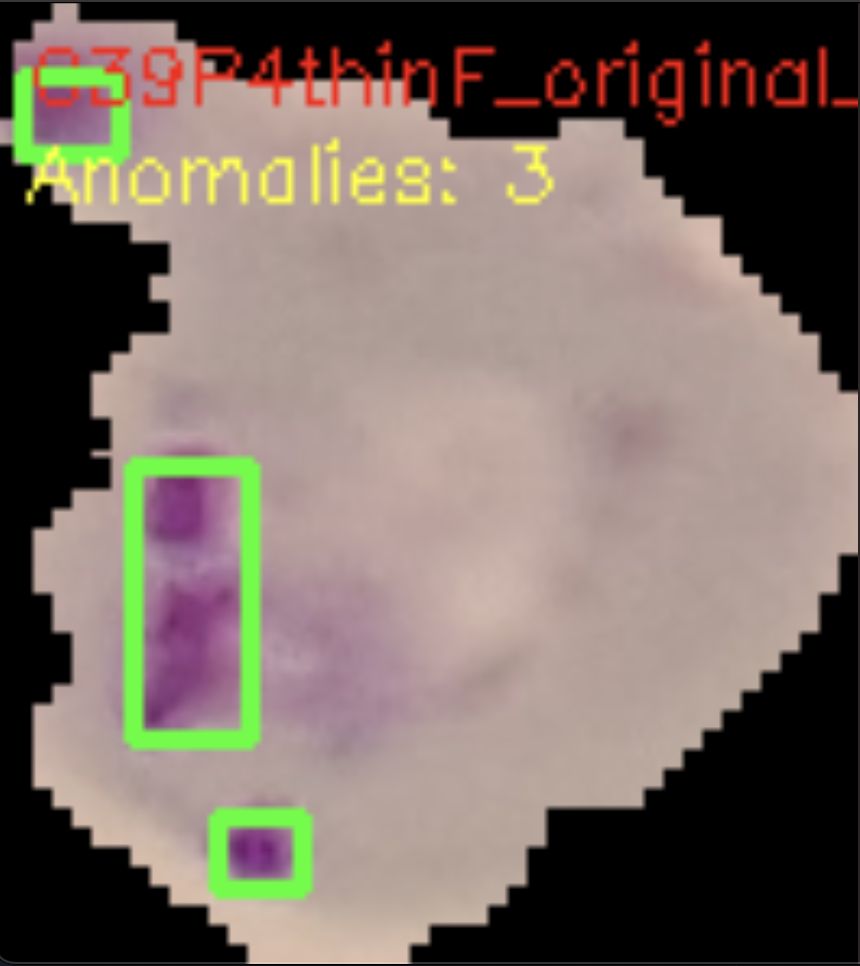
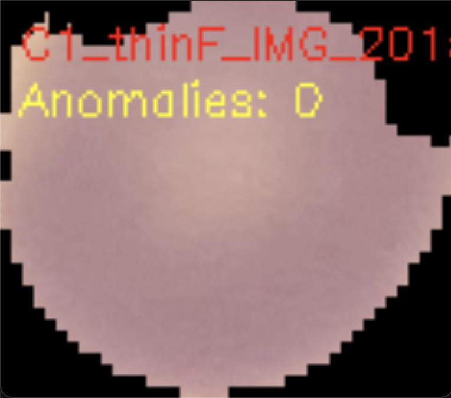

# Détection de cellules atteintes de la Malaria - Analyse d'Image

  

Ce projet est un outil d'imagerie biomédicale développé en Python. Il permet de détecter automatiquement la présence du parasite Plasmodium (responsable de la malaria) sur des images de frottis sanguins microscopiques.

L'algorithme utilise la vision par ordinateur (OpenCV) et la segmentation par couleur pour identifier les zones infectées sans nécessiter de modèles de Deep Learning complexes. (Ce qui permet une exécution ultra-rapide et peu gourmande en ressources CPU)

## Données (Dataset)

Le projet a été conçu pour fonctionner avec la base de données Kaggle suivante : **[Cell Images for Detecting Malaria](https://www.kaggle.com/datasets/iarunava/cell-images-for-detecting-malaria/data)**


Le dataset contient deux catégories d'images principales :

    ☆ Parasitized : Cellules infectées (présence de taches violettes/roses)

    ☆ Uninfected : Cellules saines

## Démonstration

Voici un exemple de résultat obtenu après analyse. Les rectangles verts indiquent les zones où le parasite a été détecté.

| Cellule Infectée | Cellule Saine |
| :--- | :--- |
| Détection positive (Anomalie) | Aucune anomalie détectée |
|  |  |


## Installation
### 1. Prérequis

Assurez-vous d'avoir Python 3 installé sur votre machine.

Sinon installez-le via le site officiel : **[Python](https://www.python.org/downloads/)**

### 2. Installation des dépendances

Le projet contient un fichier requirements.txt. Exécutez simplement la commande suivante dans votre terminal :

```bash
pip install -r requirements.txt
```

## Utilisation

Le script main.py propose deux modes d'utilisation.
### Option A : Analyser une image unique

Idéal si on ne veut que les résultat pour une seule image précise.

```bash
python main.py chemin/vers/image.png
```
Puis appuyez sur n'importe quelle touche pour fermer la fenêtre de résultat.

### Option B : Analyser un dossier (Mode Batch)

Pour traiter un grand nombre d'images à la suite et obtenir des statistiques globales.

Cette commande permet d'analyser les images les unes après les autres et de fermer la fenêtre de résultat après chaque analyse. Ou de l'arrêter à n'importe quel moment en appuyant sur q.
```bash
python main.py chemin/vers/dossier/
```

Cette commande permet de faire défiler toutes les images du dossier sans s'arrêter. Ce qui permet de gagner du temps en récupérant seulement les statistiques finales.
```bash
python main.py chemin/vers/dossier/ --batch
```

## Fonctionnement Technique

L'approche repose sur la colorimétrie des images teintées au Giemsa :

1. Conversion HSV : L'image passe de l'espace BGR (Bleu-Vert-Rouge) à l'espace Teinte-Saturation-Valeur.

2. Masquage (Masking) : On isole les pixels violets correspondants au parasite.

3. Plage HSV utilisée : [110, 50, 50] à [160, 255, 255].

4. Filtrage :

    4.1. Détection des contours via cv2.findContours.

    4.2. Suppression du bruit (artefacts < 20px).

5. Résultat : Si des anomalies valides sont détectées, l'image est classée "Infectée".

## Exemple de Rapport

En mode batch, le script génère un bilan statistique automatique dans la console :

```bash
============================================================
                    ANALYSIS REPORT
============================================================
GLOBAL STATISTICS:
   ☆ Images analysed  : 150
   ☆ Reading errors   : 0

DETECTION RESULTS:
   ☆ Images infected  : 45
   ☆ Images healthy   : 105
   ☆ Total infections : 52

PERCENTAGES:
   ☆ Infection rate   : 30.0%
   ☆ Healthy rate     : 70.0%

   [🔴🔴🔴🔴🔴🔴🔴🔴🔴🔴🟢🟢🟢🟢🟢🟢🟢🟢🟢🟢🟢🟢🟢🟢🟢🟢🟢🟢🟢🟢🟢🟢]
============================================================
```

Projet développé par : Lilou CHOUKROUN-BALZAN 

## Sources

☆ **[Wikipedia - Malaria](https://en.wikipedia.org/wiki/Malaria)**  
☆ **[Kaggle Dataset](https://www.kaggle.com/datasets/iarunava/cell-images-for-detecting-malaria/data)**  
☆ **[Mayo Clinic - Malaria Symptoms & Causes](https://www.mayoclinic.org/diseases-conditions/malaria/symptoms-causes/syc-20351184)**
